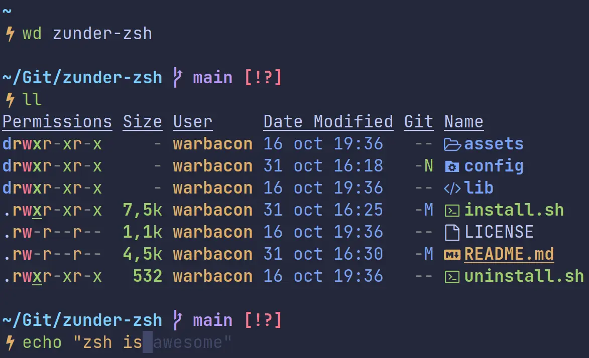

<h1 align="center">Zunder-zsh</h1>

<div align="center"> 

*It's time to get rid of Oh My Zsh.*

Zunder is a configuration utility that configures Zsh the way the user expects it to work.



</div>

> Using Catppuccin Mocha colorscheme in Kitty with JetBrainsMono Nerd Font

*"You have convinced me, [let's try it out](https://github.com/Warbacon/zunder-zsh#getting-started)!"*

## Features
- Clean and fast.
- Autosuggestions and syntax highlighting. 
- Full [Git](https://git-scm.com/) integration.
- Some useful aliases.
- Compatible with all [Oh My Zsh](https://github.com/ohmyzsh/ohmyzsh) and [Prezto](https://github.com/sorin-ionescu/prezto)
plugins and themes. Check out [zsh-snap](https://github.com/marlonrichert/zsh-snap).
- Beautiful custom prompt built with [Starship](https://starship.rs/).
- Replaces the `ls` command with [exa](https://github.com/ogham/exa).
- [Fzf](https://github.com/junegunn/fzf) integration. Try using ALT+C, CTRL+T and CTRL+R.
- Much more and it's updating! See [Installed plugins](https://github.com/Warbacon/zunder-zsh#installed-plugins).

### New aliases:
| Alias | Command                                              |
| ----- | ---------------------------------------------------- |
| ll    | Long list directory contents                         |
| la    | List directory contents with hidden files            |
| lla   | Long list directory contents with hidden files       |
| ..    | Change to the upper directory                        |
| lg    | lazygit (requires lazygit to be installed manually)  |
| q     | exit                                                 |
| clr   | clear                                                |


### Installed plugins:
- [fast-syntax-highlighting](https://github.com/zdharma-continuum/fast-syntax-highlighting) - syntax
highlighting for zsh.
- [zsh-autosuggestions](https://github.com/zsh-users/zsh-autosuggestions) - suggests previously
executed commands.
- [zsh-completions](https://github.com/zsh-users/zsh-completions) - smarter command completions.
- [zsh-autopair](https://github.com/hlissner/zsh-autopair) - automatically closes parentheses,
quotes and more.
- [wd](https://github.com/mfaerevaag/wd) - jump to custom directories without using cd.
- [sudo](https://github.com/ohmyzsh/ohmyzsh/tree/master/plugins/sudo) plugin from Oh My Zsh -
press the Esc key twice to put `sudo` at the beginning.
- [zsh-defer](https://github.com/romkatv/zsh-defer) - defers execution of a zsh command until 
zsh has nothing else to do and is waiting for user input. 

### Supported operating systems:
- Arch Linux and derivatives (Manjaro, Endeavour OS...).
- Debian/Ubuntu and derivatives (Pop OS, Kubuntu, Linux Mint...).
- Fedora.
- Android (using [Termux](https://termux.com/)).

Might support more in the future, depending on requests.

## Getting started
### Dependencies:
You **must install a [Nerd Font](https://www.nerdfonts.com/font-downloads) and set it as default font in your terminal** to see all the icons correctly. 
Alternatively, just install [icons-in-terminal](https://github.com/sebastiencs/icons-in-terminal) to use your favorite font.
On **Android**, you can install [Termux:Styling](https://f-droid.org/es/packages/com.termux.styling) and use for example Fira Code.

The following packages are needed to get everything working as intended:
- zsh
- git
- util-linux-user (only on Fedora)

**If your operating system is supported, the script will make sure you have everything correctly installed.**

### Usage:
1. Clone the repository:
   
   ```sh
   git clone https://github.com/Warbacon/zunder-zsh.git
   ```

2. Enter the cloned repository and run the `install.sh` script.
   
   ```sh
   cd ./zunder-zsh
   ./install.sh
   ```

And everything should be ready. 
Zsh-snap will be installed along with all plugins when starting a new zsh instance. 

## Troubleshooting
Zunder is under constant development, so errors may occur. I suggest you open an issue and **I'll help you as fast as I can**. 
Anyway, if you didn't like it or want to go back to your previous configuration, you can run the ``uninstall.sh`` script located in this same repository:

```bash
./uninstall.sh
```

Additionally, if you used previously another shell, you can revert it using the following command:

```bash
chsh -s $(which shell)

 # where shell is the name of the shell that you want to revert to, usually bash.
```

### Man command highlighting as error in Arch Linux
Just run these commands if you are using `man-db` (most likely):

```bash
sudo mandb
sudo systemctl enable man-db.timer
```

More info [here](https://github.com/zdharma-continuum/fast-syntax-highlighting/issues/35#issuecomment-1315195049).

## Extra info
Zunder is in very active development and it's constantly evolving, so you should check the project frequently to find out the latest news.
**I appreciate that bugs are reported and new ideas are suggested.** 
