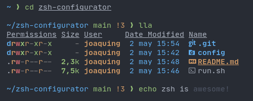

# Zunder zsh configuration

*"It's fast, really, really fast! Just get rid of Oh My Zsh already..."*

This is a simple bash script that configures zsh the way it should work out of the box. It is build on top of Zinit and Powerlevel10k prompt, so it's insanely fast.



*"You have convinced me, [let's try it out](https://github.com/Warbacon/zunder-zsh#getting-started)!"*

## Features:

- Minimal and fast.
- Compatible with all [Oh My Zsh](https://github.com/ohmyzsh/ohmyzsh) and [Prezto](https://github.com/sorin-ionescu/prezto) plugins and themes. Check out [Zinit](https://github.com/zdharma-continuum/zinit).
- Powerful and lag-free prompt thanks to [Powerlevel10k](https://github.com/romkatv/powerlevel10k).
- Replaces the `ls` command with [exa](https://github.com/ogham/exa).
- [Fzf](https://github.com/junegunn/fzf) integration (only on Arch based distros at the moment).
- Fish-like autosuggestions and syntax highlighting. 
- Bash-like key bindings.
- Some useful aliases.
- Much more and it's updating!

*"Umm, that's a lot to be minimal..."*

### New aliases:

| Alias | Command                      |
| ----- | -----------------------------|
| ll    | ls -l                        |
| la    | ls -a                        |
| lla   | ll -a                        |
| q     | exit                         |
| clr   | clear                        |
| ..    | cd ..                        |

Some of these aliases are adapted to the packages installed on your system.
Check the .zshrc file in your home directory for more info.

### Plugins installed:

- [fast-syntax-hightlighting](https://github.com/zdharma-continuum/fast-syntax-highlighting) - better and faster than zsh-syntax-highlighting.
- [zsh-autosuggestions](https://github.com/zsh-users/zsh-autosuggestions) - suggest previously executed commands.
- [zsh-completions](https://github.com/zsh-users/zsh-completions) - smarter command completions.
- [zsh-autopair](https://github.com/hlissner/zsh-autopair) - automatically close parentheses, quotes and more
- [sudo](https://github.com/ohmyzsh/ohmyzsh/tree/master/plugins/sudo) plugin from Oh My Zsh - press the Esc key twice to put ```sudo``` at the beginning.

### Supported operating systems:

- Arch Linux and derivatives (Manjaro, Endeavour OS...).
- Debian/Ubuntu and derivatives (Pop OS, Kubuntu, Linux Mint...).
- Fedora.
- ~~Android (using [Termux](https://termux.com/)).~~ Currently not working.

Might support more in the future, depending on requests.

## Getting started:

### Dependencies

**You must install a [Nerd Font](https://www.nerdfonts.com/font-downloads) and set it as default font in your terminal to see all the icons correctly.**

**Arch based distributions**

```sh
sudo pacman -S git
```

**Debian/Ubuntu based distributions**

```sh
sudo apt-get install git
```

**Fedora**

```sh
sudo dnf install util-linux-user
```

### Installation

1. Clone the repository:
   
   ```sh
   git clone https://github.com/Warbacon/zsh-configurator.git
   ```

2. Navigate to the cloned repository and run the `run.sh` script.
   
   ```sh
   cd ./zsh-configurator
   bash run.sh
   ```

3. Follow the script's installation and enjoy.

**Zinit requires you to run the ```zinit update``` command regularly to make sure everything is working properly.**

## Extend your configuration:

*Work in progress*

## Extra info:

Zunder was born as a personal project to configure the shell of the virtual machines that I test and it has become something that I think is amazing, so I am trying hard to measure up.

This is in very active development and not that popular at the moment, so
I'm alone maintaining this thing and it's possible that something unexpected
happens. **I appreciate that bugs are reported and new ideas are suggested.**